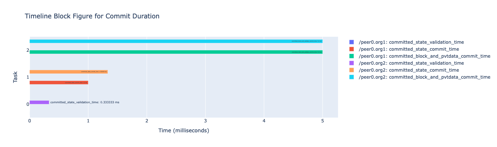

This is a tool to do performance analysis of Hyperledger Fabric, developed under Hyperledger Fabric Mentorship.
## 🎡 Working of External Service

#### This service comprises two main components:

1. Log Collection and pre-processing Pipelines for Hyperledger Fabric Docker Containers
2. Python Analysis Script

#### To utilize our service, follow these two key steps:

Step 1: Fabric Network Setup

Initiate the Hyperledger Fabric network by launching Docker containers, either using a custom setup or the official test-network.

Step 2: Docker Pipeline Activation

Navigate to /External-Service (ELK) and execute the command `docker-compose up -d` to activate the Docker Pipeline. This pipeline, comprising Logstash and Logspout, is configured to organize logs from peer and orderer containers into distinct pipelines. The logs are then stored in a CouchDB database.

Once the Docker Pipeline is running, proceed to execute the Python Analysis Script for log processing and visualization of the system's performance. The script generates various diagrams such as Timeline Block Figure and Sunburst charts based on the collected logs.

Here is example of Timeline Block Figure for Commit Duration:


## ❄️ Introducing New Log Lines for Processing in Our Service

To add a new log line, analyze the logs available in this repository or provide your custom logs. The log files are organized within folders prefixed with `LOGS:`, encompassing both INFO and DEBUG level logs for the Fabric network.

Once you've identified the specific log line you wish to include, place it within either the `peer` or `orderer` logstash pipeline. For instance, if you intend to integrate a new peer log, such as:

`2023-08-03 05:43:18.767 UTC 0049 INFO [lifecycle] InstallChaincode -> Successfully installed chaincode with package ID 'basic_1.0:d29562b85321d821cc02fddff4366e54b9bdbfa5d51647b5613141dd4d947b9e'`

Insert this into the `peer.conf` file and incorporate the required filters.

## Starting the network

### 1. Start the test network

```
// For asset-transfer-sbe chaincode:
./network.sh up createChannel

// For other chaincodes:
./network.sh up createChannel -c mychannel -ca
```

### 2. Deploy the chaincode
Commands for deploying each chaincode can be found here:

1. [asset-transfer-private-data](https://github.com/hyperledger/fabric-samples/tree/main/asset-transfer-private-data#running-the-sample)

2. [asset-transfer-basic](https://github.com/hyperledger/fabric-samples/tree/main/asset-transfer-basic#running-the-sample)

3. [asset-transfer-sbe](https://github.com/hyperledger/fabric-samples/tree/main/asset-transfer-sbe#deploy-the-smart-contract)

### 3. Submit the transactions

For asset-transfer-sbe chaincode, you can submit the transactions detailed [here](https://github.com/hyperledger/fabric-samples/tree/main/asset-transfer-sbe#run-the-transfer-scenario)

For other chaincodes, go to the sample application of choice then run the main file

For example:
```
cd asset-transfer-private-data
cd application-javascript

// install dependancies
npm install
node app.js
```

