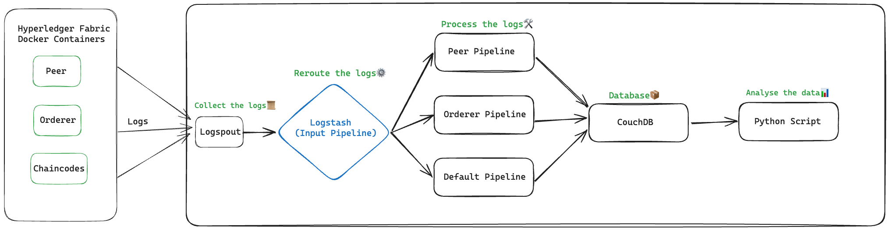

# Hyperledger Fabric performance analysis tool

## Introduction
This tool, created as part of the Hyperledger Fabric Mentorship program, serves as a means to conduct performance analysis for Hyperledger Fabric. It utilizes logs gathered from docker containers associated with Hyperledger Fabric to provide comprehensive performance insights.

 ## Development Methodology 
Firstly, we examined the logs of Hyperledger Fabric and identified key log entries that are valuable for performance analysis. These included log lines related to block validation, block reception, block commitment, and other relevant activities. Throughout our analysis, we explored different versions of Fabric, such as version 2.3, 2.4, 2.5, with and without utilizing a peer gateway to observe any discernible differences.

We used 3 chaincodes for analyzing the log. Those are:
- [asset-transfer-basic](https://github.com/hyperledger/fabric-samples/tree/main/asset-transfer-basic)
- [asset-transfer-private-data](https://github.com/mak2002/LFX-Hyperledger-Fabric-performance-analysis-with-Hyperledger-Caliper/tree/master/asset-transfer-private-data)
- [asset-transfer-sbe](https://github.com/mak2002/LFX-Hyperledger-Fabric-performance-analysis-with-Hyperledger-Caliper/tree/master/asset-transfer-sbe)

About these chaincodes:
 
1. **Asset Transfer Basic**: This is a straightforward chaincode that demonstrates the fundamental CRUD (Create, Read, Update, Delete) operations on an asset.

2. **Asset Transfer Private Data**: This sample illustrates the sending and receiving of an asset, including its private data owned by organizations, both during the creation and deletion of an asset, as well as during the transfer of an asset to a new owner.

3. **Asset Transfer State based endorsement(SBE)**: This chain code requires validation from all the organizations that are joined, hence implementing AND policy.

We established a pipeline for gathering Docker logs using Logspout from the Docker Compose file. Subsequently, we directed these logs to Logstash.

Within Logstash, distinct pipelines were configured for various services within Hyperledger Fabric. This involved setting up separate pipelines for input, peer, and orderer services.

These pipelines undertake pre-processing of the logs, channeling them into CouchDB. Post this, we retrieve the data from CouchDB and enhance its structure. Following this refinement, we proceed with performance analysis.

## Architecture 

This project can be divided into 2 parts:

1. [Logspout-Logstash-CouchDB Pipeline
](https://github.com/mak2002/LFX-Hyperledger-Fabric-performance-analysis-with-Hyperledger-Caliper/blob/master/External-Service%20(ELK)/docker-compose.yml)

    It collects the logs from Fabric docker containers, pre-process them and put them in CouchDB.

2. Python Script

     Script does the performance analysis on it.

### Logstash Pipelines
There are 4 pipelines right now, those are
1. Input pipeline
2. Peer pipeline
3. Orderer pipeline
4. Default Pipeline

The input pipeline receives the logs from the Logspout service and after recognizing the type, it re-routes them to the respective pipeline.

#### Example of Peer logs:

Validation Logs 

`2023-11-16 08:24:40.636 UTC 00cb INFO [committer.txvalidator] Validate -> [mychannel] Validated block [9] in 5ms`

Committing Logs

`2023-11-16 08:24:40.646 UTC 00cc INFO [kvledger] commit -> [mychannel] Committed block [9] with 1 transaction(s) in 9ms (state_validation=0ms block_and_pvtdata_commit=5ms state_commit=1ms) commitHash=[de5e95e6997d1d34a96bd1c9e075a46f9d28b4b341c16e608bf1c0dfd247f67d]`

Receiving of block Logs

`2023-11-16 08:24:42.695 UTC 00df INFO [gossip.privdata] StoreBlock -> Received block [10] from buffer channel=mychannel`

Example of Orderer logs:

1. Creating block logs:

`2023-07-20 14:28:07.844 UTC 003a INFO [orderer.consensus.etcdraft] propose -> Created block [4], there are 0 blocks in flight channel=mychannel node=1`

Writing block logs:

`2023-08-03 05:41:56.403 UTC 002c INFO [orderer.consensus.etcdraft] writeBlock -> Writing block [1] (Raft index: 3) to ledger channel=mychannel node=1`

Diagram of architecture of the service:

## Adding new log lines
Firstly, analyze the logs, either included in the repository or your own logs. Then find the log line you want to add. 

After that, you can make a new section for that log line in either peer.conf or orderer.conf pipeline like following:
	          
`match => { 
"fabric_log_message" => "%{TIMESTAMP_ISO8601:log_timestamp} %{GREEDYDATA} \[%{DATA:log_source}\] %{WORD:log_event} -> Received block \[%{NUMBER:block_number:int}\] from buffer channel=%{WORD:received_channel}"
}`

## Usage
1. Start the fabric network of your choice. It can be either Official test network, Fablo or custom.

2. Build the custom images for Logstash and Logspout respectively and naming them “custom-logstash-image:latest” and “my-custom-logspout:latest” as these are the names used in docker-compose.yml.
 
3. Start the external service by going into /External-Service (ELK) and executing “docker-compose up -d”. It will put the CouchDB image from the docker hub. Now it will start collecting the logs from the docker containers of Hyperledger Fabric network. 

4. After you have performed some of the necessary transaction on the test network and logs are collected, then you can run the python script to do the performance analysis.

Example of generated Timeline Block Figure for Commit Duration:	

## Conclusion
In conclusion, this tool provides a simple way to do performance analysis on Hyperledger Fabric network, regardless of the type of Fabric network you are using. If you want to learn more about the methodology referenced to make this tool, you can view the following papers:

1. [Adding Semantics to Measurements: Ontology-Guided, Systematic Performance Analysis](https://cyber.bibl.u-szeged.hu/index.php/actcybern/article/view/4278)
2. [Measurement-based performance evaluation of distributed ledger technologies](https://repozitorium.omikk.bme.hu/bitstream/handle/10890/18724/ertekezes.pdf?sequence=2&isAllowed=y)